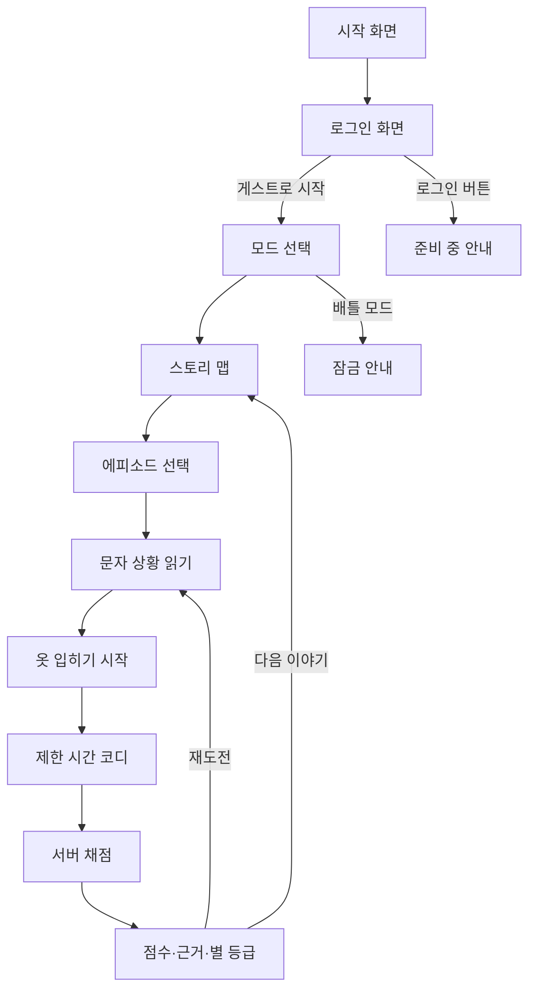

# TPO 옷입히기 웹앱 개발 계획서

> 문서 상태: 초안 v0.1
> 우선 개발 범위: 스토리 모드
> 후속 개발 범위: 배틀 모드, 실제 로그인
> 기술 기반: 웹앱 + Supabase

## 1. 문서 목적

이 문서는 `docs`의 TPO 수업자료를 바탕으로, 문자로 전달된 상황을 해석하고
알맞은 옷을 제한 시간 안에 입히는 웹게임의 개발 방향을 정의한다.

첫 번째 목표는 스토리 모드를 완성하는 것이다. 배틀 모드와 실제 로그인은
후속 단계로 두되, 스토리 모드에서 만든 채점 엔진과 데이터 구조를 그대로
재사용할 수 있도록 처음부터 확장 가능한 형태로 설계한다.

## 2. 제품 한 줄 정의

문자로 도착한 상황에서 T·P·O 단서를 찾아 캐릭터를 코디하고, 옷차림의
적절성과 제한 시간에 따라 점수를 받는 초등학생용 스토리형 옷입히기 게임.

## 3. 학습자료에서 확인한 교육 기준

### 3.1 핵심 학습 목표

- 옷의 기능을 이해한다.
- 때, 장소, 상황에 맞는 옷차림을 적용한다.
- 선택한 옷차림이 적절한 까닭을 설명한다.
- 건강·안전·예절·활동 편의와 개성을 함께 고려한다.

### 3.2 TPO 정의

| 구분 | 의미 | 게임에서 확인할 단서 |
|---|---|---|
| T - Time | 때, 시간, 계절, 날씨 | 아침·밤, 봄·여름·가을·겨울, 비·눈·미세먼지 |
| P - Place | 장소 | 학교, 과학실, 수영장, 결혼식장, 산, 집 |
| O - Occasion | 상황, 목적, 활동, 역할 | 운동, 실험, 축하, 애도, 요리, 발표, 잠자기 |

### 3.3 옷의 기능

| 대분류 | 세부 기능 |
|---|---|
| 보호 기능 | 체온 유지, 청결 유지, 신체 보호, 활동 편의와 능률 |
| 표현 기능 | 직업과 역할 표현, 예의와 존중 표현, 개성과 취향 표현 |

### 3.4 게임 설계에 적용할 원칙

1. 하나의 정답 코디만 강요하지 않는다.
2. 같은 상황에서도 안전과 예절을 지키면 여러 코디를 정답으로 인정한다.
3. 옷의 이름보다 옷이 수행하는 기능과 특징을 평가한다.
4. 안전 필수품이 빠진 코디는 빠르게 완성했더라도 높은 점수를 받을 수 없다.
5. 결과 화면에서 점수뿐 아니라 선택이 적절하거나 아쉬운 이유를 알려준다.
6. 부정적인 실패 표현보다 다시 선택할 수 있는 학습형 피드백을 사용한다.

## 4. 개발 범위

### 4.1 스토리 모드 MVP에 포함

- 시작 화면
- 로그인 화면 UI
- 로그인 없이 게스트로 시작
- 모드 선택 화면
- 스토리 맵과 에피소드 잠금 해제
- 문자 대화 형식의 상황 제시
- 제한 시간 옷입히기
- 머리·상의·하의·신발·소품 선택
- TPO 및 옷의 기능에 따른 채점
- 점수 상세 설명과 별 등급
- 재도전과 다음 이야기 진행
- 게스트 진행 상황과 최고 점수 저장
- Supabase 기반 시나리오·아이템·결과 데이터 관리
- 모바일, 태블릿, 데스크톱 대응

### 4.2 MVP에서 제외

- 실제 회원가입과 로그인
- 소셜 로그인
- 실시간 배틀 모드
- 친구 초대와 채팅
- 유료 아이템과 결제
- 사용자가 직접 만드는 시나리오
- 운영자용 별도 관리 웹사이트
- 3D 캐릭터

### 4.3 화면에는 있으나 아직 동작하지 않는 기능

- 로그인 버튼: “로그인 기능은 준비 중이에요” 안내
- 배틀 모드: 잠금 상태와 “곧 만나요” 안내
- 게스트로 시작: 정상 동작

로그인 입력값은 MVP에서 저장하거나 Supabase로 전송하지 않는다.

## 5. 주요 사용자

### 5.1 핵심 사용자

- 초등학교 5학년 학생
- 태블릿이나 PC로 수업 중 플레이하는 학생
- 모바일 기기로 혼자 연습하는 학생

### 5.2 보조 사용자

- 수업 콘텐츠를 선정하고 결과를 확인하는 교사
- 시나리오와 채점 기준을 등록하는 콘텐츠 운영자

## 6. 스토리 콘셉트

### 6.1 기본 설정

플레이어는 가칭 `TPO 스타일 구조대`의 신입 코디네이터다. 친구와 캐릭터들이
중요한 일을 앞두고 문자로 도움을 요청한다. 플레이어는 문자 속 TPO 단서를
읽고 제한 시간 안에 옷을 준비한다.

캐릭터와 서비스 이름은 개발 중 사용할 수 있는 가칭이며, 최종 이름은
브랜딩 단계에서 교체할 수 있게 콘텐츠 데이터로 관리한다.

### 6.2 이야기 전달 방식

- 상황은 3~6개의 짧은 문자 말풍선으로 전달한다.
- 튜토리얼에서는 T·P·O 단서를 색으로 안내한다.
- 일반 에피소드에서는 단서를 직접 찾아야 한다.
- 문자를 읽는 시간에는 타이머가 흐르지 않는다.
- `옷 입히기 시작` 버튼을 누른 순간부터 타이머가 시작된다.
- 결과 화면에서 실제 T·P·O와 옷 선택의 근거를 공개한다.

### 6.3 권장 에피소드 구성

스토리 모드 1차 버전은 프롤로그와 4개 챕터, 총 12개 에피소드로 구성한다.

| 챕터 | 에피소드 | 주요 학습 요소 |
|---|---|---|
| 프롤로그 | 구조대 입단 시험 | TPO와 옷입히기 조작 학습 |
| 1. 바쁜 하루 | 늦잠 후 등교와 체육 수업 | 학교, 활동성, 운동화 |
|  | 저녁에 잠잘 준비 | 편안함, 흡습성, 잠옷 |
|  | 친구의 생일 파티 | 장소와 상황, 개성 표현 |
| 2. 날씨 특보 | 비 오는 날 마트 심부름 | 밝은색, 방수, 장화·우산 |
|  | 여름 워터파크 | 수영복, 수영모, 물놀이 안전 |
|  | 겨울 스키 교실 | 체온, 방수, 장갑, 안전 장비 |
| 3. 마음을 입어요 | 친척 결혼식의 화동 | 단정함, 축하, 지나친 화려함 피하기 |
|  | 장례식 참석 | 어두운색, 단정함, 장식 최소화 |
|  | 설날 할머니 댁 방문 | 한복 또는 단정한 옷, 예절 |
| 4. 안전 출동 | 과학실 실험 | 실험복, 보안경, 장갑, 긴바지, 막힌 신발 |
|  | 가족을 위한 요리 | 고정된 소매, 긴바지, 앞치마, 머리 정리 |
|  | 좀비 도시 탈출 | 활동성, 신체 보호, 안전한 신발 |

### 6.4 후속 에피소드 후보

- 미세먼지가 심한 날 외출
- 가을 산행과 별자리 관찰
- 체육대회와 공개 발표가 함께 있는 날
- 외계인과의 첫 만남
- 조선 시대 시간여행
- 얼음 왕국의 초대
- 동물들이 사는 숲 방문

## 7. 전체 사용자 흐름



## 8. 화면별 요구사항

### 8.1 시작 화면

- 게임 로고와 대표 캐릭터
- `시작하기` 버튼
- 음향과 접근성 설정 진입

### 8.2 로그인 화면

- 이메일 입력란
- 비밀번호 입력란
- 로그인 버튼
- `게스트로 시작` 버튼
- 로그인 버튼을 누르면 준비 중 안내를 표시
- 입력 내용은 저장·전송하지 않음

### 8.3 모드 선택

- 스토리 모드: 선택 가능
- 배틀 모드: 잠금 상태
- 마지막으로 진행한 스토리 위치 표시

### 8.4 스토리 맵

- 챕터와 에피소드 카드
- 잠금, 완료, 별 개수, 최고 점수 표시
- 직전 에피소드를 완료하면 다음 에피소드 해제
- 완료한 에피소드는 자유롭게 재도전 가능

### 8.5 문자 상황 화면

- 발신자 캐릭터
- 시간순 문자 말풍선
- 필요한 경우 날씨·일정 사진 또는 아이콘
- 튜토리얼용 T·P·O 단서 강조
- `옷 입히기 시작` 버튼

### 8.6 옷입히기 화면

- 중앙: 2D 캐릭터
- 하단 또는 측면: 옷장
- 분류: 머리, 상의, 하의, 신발, 소품
- 선택한 옷은 캐릭터에 즉시 적용
- 같은 부위의 다른 옷을 선택하면 자동 교체
- 선택 취소와 전체 초기화
- 남은 시간 표시
- `코디 완료` 버튼
- 드래그 조작은 보조 기능으로 제공하고, 기본 조작은 터치·클릭으로 지원

### 8.7 결과 화면

- 총점과 별 등급
- 최고 점수 갱신 여부
- 점수 항목별 막대 또는 목록
- 잘 선택한 옷
- 빠뜨린 필수 기능
- 상황에 맞지 않는 옷
- 실제 T·P·O 해설
- 캐릭터의 결과 대사
- 재도전과 다음 에피소드 버튼

## 9. 옷입히기 시스템

### 9.1 캐릭터 레이어

캐릭터는 동일한 기준점과 크기를 사용하는 2D 레이어로 구성한다.

아래에서 위 순서의 기본 레이어 예시는 다음과 같다.

1. 캐릭터 기본 몸
2. 하의
3. 신발
4. 상의
5. 겉옷
6. 머리 장식
7. 소품
8. 전면 효과

각 아이템은 `slot`, `layer_order`, `asset_key`, `anchor_version`을 가진다.
같은 기준 템플릿으로 제작된 이미지만 조합하도록 하여 옷이 어긋나는 문제를
줄인다.

### 9.2 아이템 태그

옷의 이름이 아닌 특성으로 채점하기 위해 각 아이템에 태그를 부여한다.

예시:

```text
밝은색, 어두운색, 단정함, 격식, 활동성, 방수, 방한,
흡습, 통풍, 긴소매, 긴바지, 미끄럼방지, 신체보호,
직업표현, 전통, 수영, 실험안전, 조리안전
```

한 아이템은 여러 태그를 가질 수 있다. 예를 들어 밝은 노란색 우비는
`밝은색`, `방수`, `비`, `신체보호` 태그를 함께 가진다.

### 9.3 시나리오 규칙

각 시나리오는 다음 규칙을 가진다.

- 필수 태그: 없으면 안전 또는 핵심 목적을 달성하지 못함
- 권장 태그: 있으면 더 적절한 코디
- 금지 태그: 상황과 충돌하거나 위험함
- 허용 태그: 개성 표현에 사용할 수 있음
- 필수 슬롯: 반드시 착용해야 하는 부위
- 선택 가능한 아이템 목록
- 항목별 피드백 문장

정답 아이템 ID를 직접 지정하지 않고 태그 조합을 평가하여 여러 정답을
인정한다.

## 10. 채점 규칙

### 10.1 총점

총점은 100점이며 다음 항목으로 구성한다.

| 평가 항목 | 배점 | 설명 |
|---|---:|---|
| TPO 적합성 | 30점 | T, P, O에 각각 10점 |
| 보호·안전·활동 기능 | 30점 | 체온, 신체 보호, 위생, 활동 편의 |
| 예절·표현 | 20점 | 상황에 대한 존중, 역할, 적절한 개성 |
| 코디 완성도 | 10점 | 필수 부위 착용과 충돌 없는 조합 |
| 시간 보너스 | 10점 | 남은 시간 비율에 따라 계산 |

### 10.2 시간 보너스

```text
시간 보너스 = 반올림(10 × 남은 시간 ÷ 제한 시간)
```

- 상황을 읽는 시간은 포함하지 않는다.
- 시간이 끝나면 현재 코디가 자동 제출된다.
- 시간 초과 시 시간 보너스는 0점이다.
- 속도만으로 부적절한 코디가 높은 점수를 받지 않도록 최대 10점으로 제한한다.

### 10.3 안전 필수 조건

- 안전 필수 태그가 하나라도 빠지면 총점 상한을 59점으로 제한한다.
- 위험한 금지 아이템은 항목별로 5~20점을 감점한다.
- 같은 옷이 필수 기능을 여러 개 충족하면 중복 점수를 무제한으로 주지 않는다.
- 필수 아이템을 모두 갖췄더라도 상황에 맞지 않는 아이템을 함께 착용하면 감점한다.

예: 과학실에서 실험복을 입었더라도 슬리퍼를 신으면 안전 점수와 완성도
점수가 감소한다.

### 10.4 별 등급

| 총점 | 결과 |
|---:|---|
| 90~100점 | 별 3개 |
| 75~89점 | 별 2개 |
| 60~74점 | 별 1개 |
| 0~59점 | 다시 도전 |

다음 에피소드는 별 1개 이상을 받으면 열린다. 별 3개는 선택 목표로 두어
진행이 지나치게 막히지 않게 한다.

### 10.5 동점 처리

스토리 모드에서는 동점 처리가 필요하지 않다. 에피소드별 최고 점수와
최단 시간을 각각 저장한다.

배틀 모드에서는 향후 다음 순서로 승자를 결정한다.

1. 안전 필수 조건 충족 여부
2. 총점
3. 적절성 점수
4. 완료 시간

## 11. 피드백 설계

결과 피드백은 정답 목록을 보여주는 방식이 아니라 선택의 이유를 설명한다.

### 11.1 긍정 피드백 예시

- “밝은 우비를 골라 비를 막고 운전자에게도 잘 보이게 했어요.”
- “움직이기 편한 운동화라 체육 활동에 잘 어울려요.”
- “단정한 옷차림으로 결혼을 축하하는 마음을 표현했어요.”

### 11.2 개선 피드백 예시

- “비 오는 날에는 잘 미끄러지지 않고 물이 스며들지 않는 신발이 필요해요.”
- “과학실에서는 눈을 보호할 보안경을 꼭 착용해 주세요.”
- “장례식에서는 화려한 장식보다 차분하고 단정한 옷이 더 알맞아요.”

### 11.3 피드백 원칙

- 틀렸다는 말만 사용하지 않는다.
- 부족한 기능과 그 이유를 함께 안내한다.
- 인정된 다른 정답 조합의 예를 1~2개 제시할 수 있다.
- 캐릭터의 외모나 체형을 평가하지 않는다.
- 성별에 따라 옷을 제한하지 않는다.

## 12. Supabase 설계

### 12.1 사용 범위

- 챕터와 시나리오 저장
- 문자 메시지 내용 저장
- 옷 아이템과 태그 저장
- 시나리오 채점 규칙 저장
- 게스트 세션과 진행 상황 저장
- 플레이 결과와 최고 점수 저장
- 캐릭터 및 옷 이미지 저장
- 서버 측 채점 함수 실행

### 12.2 주요 테이블

| 테이블 | 주요 필드 | 용도 |
|---|---|---|
| `chapters` | `id`, `slug`, `title`, `order_no`, `published` | 챕터 순서와 공개 상태 |
| `scenarios` | `id`, `chapter_id`, `title`, `difficulty`, `time_limit_sec`, `tpo_*`, `published` | 에피소드 기본 정보 |
| `scenario_messages` | `id`, `scenario_id`, `order_no`, `speaker`, `message` | 문자 대화 |
| `clothing_items` | `id`, `name`, `slot`, `tags`, `asset_key`, `layer_order`, `active` | 옷과 소품 |
| `scenario_items` | `scenario_id`, `item_id` | 에피소드에서 보여줄 옷 |
| `scenario_rules` | `scenario_id`, `rule_type`, `tag`, `weight`, `mandatory`, `feedback` | 채점 기준 |
| `guest_sessions` | `id`, `created_at`, `last_seen_at` | 로그인 전 사용자 구분 |
| `story_runs` | `id`, `guest_id`, `scenario_id`, `started_at`, `submitted_at`, `score_total`, `score_breakdown` | 플레이 기록 |
| `run_items` | `run_id`, `item_id`, `slot` | 제출한 코디 |
| `story_progress` | `guest_id`, `scenario_id`, `best_score`, `best_time_ms`, `stars` | 에피소드 진행 상황 |

실제 로그인을 도입할 때는 `profiles`를 `auth.users`와 연결하고,
`guest_id`의 진행 기록을 사용자 계정으로 이전한다.

### 12.3 이미지 저장

Supabase Storage에 다음과 같은 버킷 또는 경로를 사용한다.

```text
characters/{character_id}/base.png
clothing/{item_id}/full.png
clothing/{item_id}/thumbnail.png
scenarios/{scenario_id}/background.png
```

아이템 이미지에는 버전 값을 두어 캐릭터 기준점이 바뀔 때 이전 이미지가
잘못 조합되지 않게 한다.

### 12.4 서버 채점

최종 점수는 브라우저가 아닌 Supabase Edge Function에서 계산한다.

권장 함수:

```text
start-story-run
submit-story-run
```

- `start-story-run`: 서버 시작 시각과 플레이 토큰 생성
- `submit-story-run`: 선택한 아이템과 서버 경과 시간을 검증하고 점수 계산
- 클라이언트는 점수 규칙의 가중치와 정답을 직접 결정하지 않음
- 배틀 모드에서도 같은 채점 코드를 재사용

### 12.5 보안 원칙

- 클라이언트에는 Supabase 공개 키만 사용한다.
- 서비스 역할 키는 서버 함수에서만 사용한다.
- 공개된 챕터·시나리오·아이템만 익명 읽기를 허용한다.
- 플레이 결과 테이블은 클라이언트의 직접 쓰기를 막는다.
- 결과는 서버 채점 함수를 통해서만 저장한다.
- MVP에서는 이름, 이메일 등 개인정보를 수집하지 않는다.

## 13. 웹앱 구조

### 13.1 권장 기술

- Next.js
- TypeScript
- 반응형 CSS 또는 Tailwind CSS
- Supabase Database, Storage, Edge Functions
- 점수 계산용 순수 TypeScript 모듈
- 브라우저 자동화 기반 주요 흐름 테스트

특정 라이브러리는 구현 시점에 프로젝트 환경을 확인한 뒤 최소한으로
추가한다. 옷입히기 화면의 상태는 우선 React 기본 상태 관리로 시작한다.

### 13.2 권장 경로

```text
/
/login
/modes
/story
/story/[chapterSlug]
/play/[scenarioSlug]
/result/[runId]
/settings
```

### 13.3 상태 구분

- 콘텐츠 상태: Supabase에서 읽는 챕터, 시나리오, 아이템
- 플레이 상태: 현재 선택한 옷, 남은 시간, 현재 단계
- 진행 상태: 완료 여부, 최고 점수, 별 개수
- 화면 설정: 음향, 진동, 애니메이션 감소

## 14. 디자인 및 사용성 원칙

### 14.1 시각 방향

- 초등학생이 쉽게 읽을 수 있는 밝고 친근한 분위기
- 중앙 캐릭터와 문자 상황이 첫눈에 보이는 단순한 화면
- 학습지의 구조는 참고하되 웹게임답게 짧고 즉각적인 상호작용 사용
- 점수보다 “왜 알맞은가”가 보이는 결과 화면
- 원본 수업자료의 캐릭터와 이미지는 제품에 직접 사용하지 않음

### 14.2 저작권 원칙

학습자료에 포함된 짱구, 펭수, 연예인, K-pop 관련 캐릭터와 기존 상품
이미지는 학습 참고용으로만 사용한다. 실제 웹앱에는 자체 제작한 캐릭터,
옷, 배경, 아이콘을 사용한다.

### 14.3 접근성

- 드래그 없이도 모든 옷을 선택할 수 있어야 함
- 키보드만으로 옷 선택과 제출 가능
- 색상만으로 정답·오답을 표현하지 않음
- 타이머는 숫자와 시각적 게이지를 함께 제공
- 효과음은 끌 수 있어야 함
- 애니메이션 감소 설정 지원
- 작은 화면에서도 주요 버튼의 터치 영역을 충분히 확보

## 15. 콘텐츠 제작 규칙

각 에피소드는 다음 내용을 갖춘 뒤 등록한다.

1. 학습 목표
2. 문자 상황
3. T·P·O 정답 근거
4. 제한 시간
5. 제공 아이템
6. 필수·권장·금지 태그
7. 좋은 코디 예시 3개 이상
8. 부분 정답 코디 예시 2개 이상
9. 위험하거나 부적절한 코디 예시 2개 이상
10. 항목별 피드백
11. 캐릭터의 성공·아쉬움 결과 대사

시나리오를 공개하기 전에 교사 관점의 검토를 거친다.

## 16. 개발 단계

아래 일정은 1인 개발, 기본 일러스트 자산이 준비되어 있다는 가정의
상대적인 작업량이다.

| 단계 | 주요 결과물 | 예상 작업일 |
|---|---|---:|
| 0. 기반 설계 | 화면 흐름, 데이터 정의, 캐릭터 레이어 규격 | 1~2일 |
| 1. 프로젝트 기반 | 웹앱 구조, Supabase 연결, 로그인 화면 UI | 2~3일 |
| 2. 수직 시제품 | 문자 → 옷입히기 → 채점 → 결과 1개 완성 | 3~4일 |
| 3. 스토리 시스템 | 스토리 맵, 잠금 해제, 진행 저장, 재도전 | 3~4일 |
| 4. 콘텐츠 확장 | 4개 챕터, 12개 에피소드와 아이템 등록 | 4~6일 |
| 5. 검증과 보정 | 기기 테스트, 점수 보정, 접근성, 오류 수정 | 2~3일 |

총 예상 기간은 약 15~22 작업일이다. 캐릭터와 옷 일러스트를 새로 제작하는
기간은 별도로 산정한다.

## 17. 구현 우선순위

### P0 - 반드시 완성

- 문자 상황 제시
- 옷 선택과 캐릭터 적용
- 타이머
- 태그 기반 채점
- 안전 필수 조건
- 결과 피드백
- 게스트 진행 저장
- 반응형 화면

### P1 - 스토리 완성도

- 챕터 맵
- 캐릭터 표정과 결과 대사
- 별 등급
- 최고 점수
- 간단한 효과음과 전환 효과

### P2 - 후속 개선

- 옷 컬렉션
- 업적
- 교사용 결과 요약
- 더 많은 캐릭터
- 선택 가능한 난이도

## 18. 테스트 계획

### 18.1 채점 테스트

각 시나리오마다 다음 고정 테스트 데이터를 만든다.

- 모범 코디
- 다른 형태의 모범 코디
- 부분 정답 코디
- 안전 필수품이 빠진 코디
- 금지 아이템이 포함된 코디
- 제한 시간 종료 코디

같은 입력은 항상 같은 적절성 점수를 반환해야 한다. 시간 보너스를 제외한
점수는 클라이언트 환경에 따라 달라지지 않아야 한다.

### 18.2 기능 테스트

- 게스트 시작
- 에피소드 잠금과 해제
- 옷 착용·교체·취소
- 시간 종료 자동 제출
- 결과 저장 실패 후 재시도
- 재도전
- 새로고침 후 진행 복구

### 18.3 화면 테스트

- 모바일 360px
- 일반 태블릿
- 교실용 대형 화면
- 데스크톱
- 터치와 마우스
- 키보드 조작
- 애니메이션 감소 설정

### 18.4 교육 검토

- 상황 문장이 5학년 수준에 맞는가
- TPO 단서가 충분하지만 지나치게 직접적이지 않은가
- 정답이 하나로 고정되지 않았는가
- 안전과 예절의 설명이 정확한가
- 특정 성별·체형·문화에 대한 편견이 없는가

## 19. 주요 위험과 대응

| 위험 | 대응 |
|---|---|
| 정답 코디가 지나치게 제한됨 | 아이템 ID가 아닌 태그와 기능으로 평가 |
| 빠른 선택이 안전한 선택보다 유리함 | 시간 배점을 10점으로 제한하고 안전 미충족 시 점수 상한 적용 |
| 옷 이미지가 캐릭터와 어긋남 | 공통 기준점, 레이어 규격, 자산 버전 검사 |
| 콘텐츠마다 점수 난이도가 다름 | 시나리오별 모범·부분·오답 테스트 세트 운영 |
| 클라이언트 점수 조작 | 서버 시작 시각과 Edge Function 채점 사용 |
| 기존 교육자료 이미지의 저작권 문제 | 자체 캐릭터와 자체 제작 자산만 제품에 사용 |
| 로그인 도입 시 게스트 기록 손실 | `guest_id`를 계정에 이전하는 병합 절차 설계 |

## 20. 스토리 모드 MVP 완료 기준

아래 조건을 모두 충족하면 스토리 모드 MVP를 완료한 것으로 본다.

- 로그인 화면에서 개인정보를 전송하지 않고 게스트로 시작할 수 있다.
- 스토리 맵에서 에피소드를 선택하고 잠금 해제할 수 있다.
- 최소 12개 에피소드가 플레이 가능하다.
- 모든 에피소드가 문자 상황, 제한 시간, 옷입히기, 채점, 결과 흐름을 가진다.
- 클릭·터치·키보드로 옷을 입힐 수 있다.
- 여러 개의 적절한 코디가 정답으로 인정된다.
- 안전 필수 조건이 점수에 우선 반영된다.
- 서버에서 점수를 계산하고 Supabase에 최고 기록을 저장한다.
- 결과 화면에서 점수의 이유를 항목별로 확인할 수 있다.
- 새로고침 후에도 게스트의 완료 기록이 유지된다.
- 배틀 모드는 잠금 상태로 표시된다.
- 모바일, 태블릿, 데스크톱에서 주요 흐름을 완료할 수 있다.
- 학습자료의 기존 캐릭터와 이미지를 제품에 직접 사용하지 않는다.

## 21. 배틀 모드를 위한 선행 설계

배틀 모드는 MVP 범위가 아니지만 다음 요소는 스토리 모드 개발 때부터
공용으로 만든다.

- 동일한 시나리오와 아이템 세트
- 동일한 서버 채점 엔진
- 서버 기준 시작·종료 시각
- 제출 후 수정 불가한 플레이 결과
- 점수 상세 내역
- 동점 처리 규칙

추후 배틀 모드는 두 사용자가 같은 시나리오와 같은 옷장을 받아 제한 시간
내 코디한 뒤, 안전 조건·총점·적절성·시간 순으로 승자를 결정한다.

## 22. 첫 구현 목표

전체 시스템을 한 번에 만들기 전에 다음 한 장면을 수직 시제품으로 완성한다.

> “비가 오는 저녁, 집 근처 마트에 심부름을 가야 해.”

필요 기능:

- 문자 상황 3개
- 60초 타이머
- 상의·하의·신발·소품 선택
- 밝은색·방수·활동성·미끄럼 방지 태그
- 우비·장화·우산을 포함한 여러 정답 조합
- 어두운 옷·슬리퍼 등에 대한 감점
- 서버 채점
- 결과 설명

이 수직 시제품으로 옷 레이어, 조작감, 채점 공정성, Supabase 저장,
모바일 화면을 먼저 검증한 뒤 나머지 에피소드를 확장한다.
