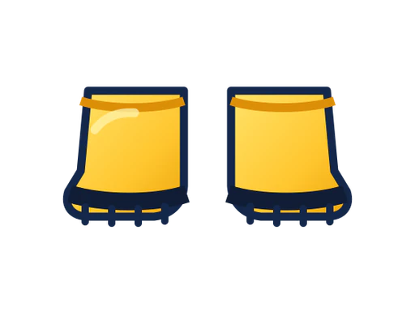
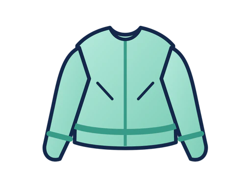
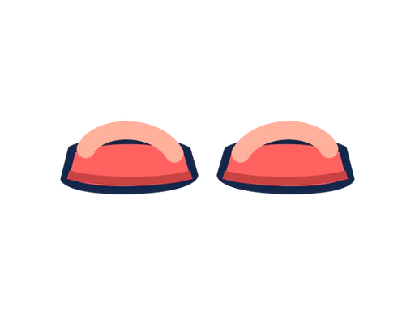
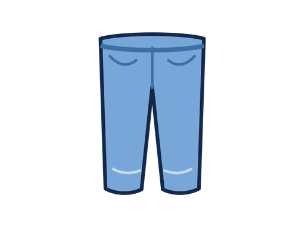
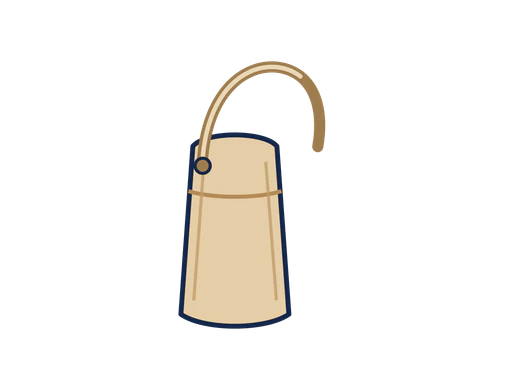
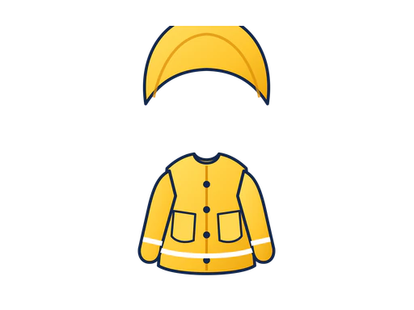
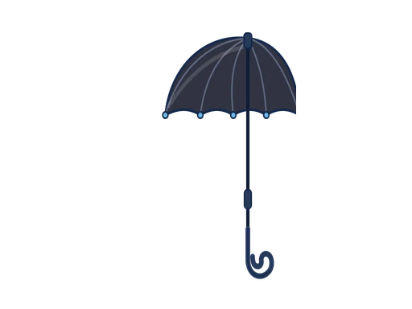
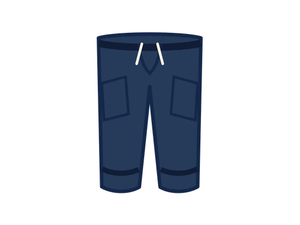
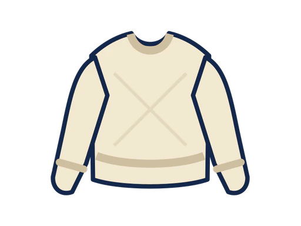

# TPO 아이템 식별 카드

진행자는 이 화면만 참가자에게 보여 준다. 파일명이나 정답표는 보여 주지
않는다. 질문은 “무엇처럼 보여?”, “언제 사용하면 좋을까?”처럼 중립적으로
한다.

| 카드 1 | 카드 2 | 카드 3 | 카드 4 |
|---|---|---|---|
|  |  |  |  |
| **1** | **2** | **3** | **4** |

| 카드 5 | 카드 6 | 카드 7 | 카드 8 |
|---|---|---|---|
|  |  |  |  |
| **5** | **6** | **7** | **8** |

| 카드 9 | 카드 10 | 카드 11 | 카드 12 |
|---|---|---|---|
|  |  |  |  |
| **9** | **10** | **11** | **12** |

| 카드 13 | 카드 14 | 카드 15 | 카드 16 |
|---|---|---|---|
|  |  |  |  |
| **13** | **14** | **15** | **16** |
